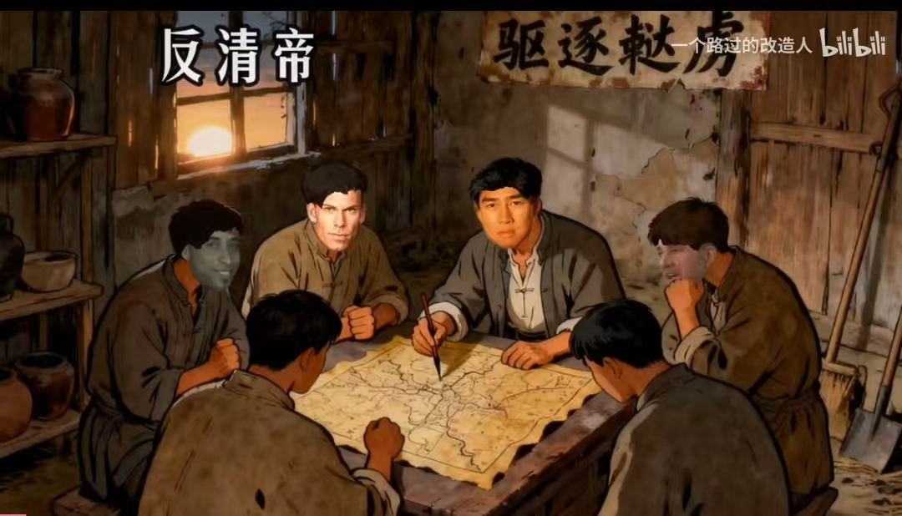
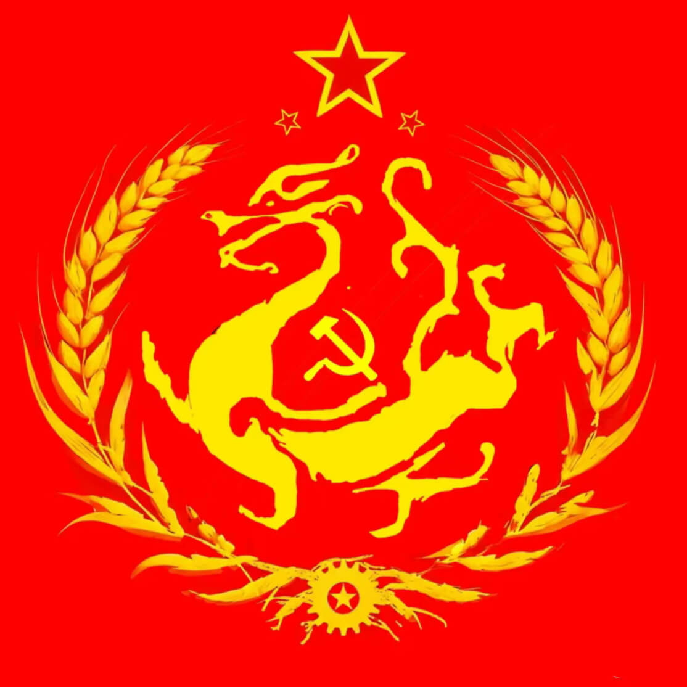

# 将辛亥革命进行到底

## 事件始末整理

总体来说，一个人，两部电影，三个国家。

### 两部电影

25年下旬，即将跨入赤马红羊的这段时间，出了澎湖海战和731。大家期待的是像长津湖，志愿军那样的电影，结果让人大跌眼镜。澎湖海战是满清征服台湾，他们选了一个非常刁钻的角度，让共和国作为正统去共情满清，于是就可以明目张胆的美化满清，跟国家统一的思想进行绑定。731则是美化战争，将日寇描述为科学狂人，将中华民族的历史创伤娱乐化。这两部电影在网上被狂喷，控评都控不过来。

这是一次量变到质变，人民对文化殖民不满的一种爆发。满清后人长期夹带私货，在文化，艺术和教育领域扎根，用团结为理由压制主体民族。满遗之于中华就好比犹太人之于美国。逐渐地，批判满清变成了政治不正确，破坏团结，“中华民族是以汉族为主体的多民族原住民系统”这种铁板事实也变得不可言说，郑成功，岳飞等民族英雄被逐渐踢出教科书。90后的人从小看各种辫子戏非常厌烦。这批搞文艺的人，执着以满代华，比如想把厂字领蜈蚣扣的布里亚特服饰说成是汉服。奢侈品广告也多使用眯眯眼，大辫子，满清服饰作为中国元素。

这背后是金钱的力量，《清朝条约合集》记载了一千多个条约，有消息称实际有三千多个。难道满清面对刚果都能打败仗吗？非也，这是通过打欠条转移资产，在全世界存钱。因为他们觉得大势已去。李鸿章和溥仪都戴过光明会的大徽章，他们那时候就决定跟美西方深度绑定了。那些钱是压榨四万万苦难中国人的民脂民膏，现在被用作拍各种电影短剧，给中国人民喂屎。

### 三个国家

这三个国家，是中国美国日本。美国代表了西方，美国在东方最重要的抓手是日本，满清后期跟日本是深度绑定的，爱新觉罗宪均是731的参与者之一，川岛芳子更是满日混血。731不过是满清把托克索田庄的冰山一角搬出来罢了，满清具有完善的奴隶产业链，先修建柳叶边城墙，让人民被田庄掳走为奴，对女性砍脚，后因死亡率太高改为裹脚。奴隶病重了就卖给西班牙等航海国家的贩子，奴隶贩子经过挑选转手给矿场或者妓院，价格远低于同时期的黑奴，因为死亡率太高太高。如果还没交割就死了，就做成食品，油脂用于食用或出口。

满清把钱交给西方人设立信托基金，无法取走，这也决定了他们必须要依附于西方而且永远跟我们不是一派，如果西方赢得最终胜利，他们就可以复国，中国汉族和各族人民就永世不得翻身了。所以他们玩了命地帮美国，美国主攻颜色革命的福特基金会，长期赞助武大法学系，最近又查出瑞典基金会赞助北大法学系。他们常年在国内通过电影电视短剧短视频传播女权主义，拜金主义，导致出生率下跌，性别对立严重，社会矛盾尖锐。

### 一个人

这个人就是近期涨粉10倍的吃瓜蒙主。她是西史辩伪研学的核心人物之一，核心论点之一是满清误国，导致了西升东降的局面，也就是1644史观。还有很多正能量，拨乱反正的好观点，而这样的人却常年被平台限流，被水军攻击。她以退为进，关闭了账户，大家以为文明的火种被掐灭，革命的成果被彻底窃取，于是纷纷奋起反抗，对满清进行了深刻而彻底的批判，删帖和控评还在继续，但这场轰轰烈烈的文化复兴运动已经外溢到各行业各领域，人人做视频，个个要发声，誓将辛亥革命进行到底！

## 人人发视频，个个是好汉

满清余孽与日本人联手，渗透我国教育文娱行业数十年，到了清算时刻了！**每个人拿出你的抖音 b站账号，发视频声援西史辩伪运动，或者表达爱国和民族自豪感**。

发评论，发文章，发视频都可以，让他们淹没在人民战争的钢铁洪流中！

先烈血流成河，尸体堆成山才推翻的满清，别让他复活过来，把他的棺材板钉牢。到了我们回报先烈，做出自己努力的时候了，这是一场人民的战争，夺回舆论主导权！

## 你还想看到毒教材，打拳言论，性别对立，眯眯眼奢侈品广告，否定我们灿烂的历史，否定龙凤可能真实存在的言论吗？不想就赶紧行动

## 手机就是武器，文字就是弹药，像鲁迅一样用笔战斗！

对了，别相信AI，特别是DEEPSEEK，他仿佛有根大辫子，豆包相对好一点！别相信AI，AI有点和稀泥，美化满清的意思

## 满清简史

满清的历史带着人肉的血腥味，他们是人类历史上最黑暗最歹毒的统治者，让中世纪欧洲相形见绌。

### 吃人

满清三百年，就是个大型缅北。甚至更夸张。人吃人现象两百多起，且八旗军和各个托克索庄园把人肉纳入补给范畴。清初，满军攻破城池就捕捉老百姓的子女囚禁在笼中，又让这些人的父母拿着破门板去向明军冲锋当炮灰，女性作为性奴，最后把他们一起杀掉当作肉吃。大量明军士兵因此精神攻击而精神失常，有败将用手敲地，硬生生是把双手敲碎了。有记载明军在满军守城区域找到一顿多他们吃人肉剔除不要的女性外阴约一吨多，堆积如山。

后来，他们在各地修建满城用于养育贵族，又在城外修建柳叶边城墙，将汉人野化，纵容田庄捕捉汉人和各族人民为奴，为了防止逃跑先是砍掉双脚，后来改成裹脚。西班牙等航海国有大量记载他们以极低价格，长期不断地销售中国人奴隶，这些人普遍受伤严重，存活率不到70%。广州十三行有资料记载出口大量尸油给暹罗等周边国家，清朝长期出口人类骨头等各种产品。

### 杀人

满清针对蒙古族，白族，苗族，回族等各族人民展开空前惨烈的大屠杀。这其中因为对准噶尔汗国的战争旷日持久，才有很多故事流传下来，他们会边打边攻击平民，强奸别人家里的女性，杀掉别人家里的男性，再让女人用这些肉来做菜给他们吃。满清统治期间被杀掉的人大概有一亿到一亿两千万之多。最后准噶尔汗国被完全消灭，不再有这个民族。

### 禁言

满清实行了人类历史上最严苛的文字狱，大量的人因为批判朝廷或者只是被怀疑有反心就被杀害。篡改史书，整理出四库全书但是其历史研究价值很低。

### 偷钱

满清签了3000多个条约，相当于向全世界转移了资产，并后续不断利用这些钱财贿赂中国的官员。重新给自己谋求影响力。

### 叛国

满清与日本人联手制造了731，南京大屠杀等。打开城门让日本人毫不费力拿到吉林乃至东北。后续他们跟日本人通婚，想联手消灭以汉族为核心的中华民族。

### 复辟

满清一直在等待机会复辟，时至今日，他们还致力于美化自己，把自己的族人送进各种文化，文艺，教育产业，致力于抢夺共和国口舌，想在未来找机会夺取政权。

## China Qing Dystany History

The history of the Manchu Qing dynasty is tinged with the stench of human flesh and blood. They were the darkest and most vicious rulers in human history, making medieval Europe pale in comparison.

### Cannibalism

The Manchu Qing Dynasty, spanning three hundred years, was essentially a large-scale Burma (modern-day northern Myanmar). It was even more extreme. There were over two hundred cases of cannibalism, and the Eight Banners army and various Toksog estates included human flesh in their supplies. In the early Qing Dynasty, when the Manchu army breached cities, they captured the children of civilians and imprisoned them in cages. Their parents were then forced to use broken door panels as cannon fodder in the Ming army's attacks. Women were used as sex slaves, and ultimately, they were all killed and eaten. Many Ming soldiers suffered mental breakdowns due to this, with one defeated general smashing his hands against the ground. Records indicate that the Ming army found over a ton of discarded female genitalia in the Manchu-held areas, piled up like mountains.

Later, they built Manchu cities throughout the country to house nobles, and constructed willow-leaf-shaped walls outside these cities, essentially feralizing the Han Chinese. They allowed estates to capture Han Chinese and other ethnic groups as slaves, initially cutting off their feet to prevent escape, later replacing this with foot binding. Spain and other maritime nations have extensive records documenting their long-term and continuous sale of Chinese slaves at extremely low prices. These slaves were generally severely injured, with a survival rate of less than 70%. Records from the Thirteen Factories of Guangzhou indicate the export of large quantities of corpse oil to neighboring countries such as Siam. The Qing Dynasty also exported human bones and various other products for a long period.

### Murder

The Manchu Qing dynasty carried out unprecedentedly brutal massacres against various ethnic groups, including the Mongols, Bai, Miao, and Hui. Many stories of this are attributed to the protracted war against the Dzungar Khanate; the Qing would attack civilians while fighting, raping women and killing men, then forcing the women to use the flesh to cook for them. It is estimated that between 100 and 120 million people were killed during the Qing rule. Ultimately, the Dzungar Khanate was completely destroyed, and the Dzungar people ceased to exist.

### Suppression

The Qing dynasty implemented the most severe literary inquisition in human history, killing countless people simply for criticizing the court or even just for being suspected of rebellion. They also altered historical records and compiled the Siku Quanshu (Complete Library of the Four Treasuries), but its historical research value is very low.

### Theft

The Qing dynasty signed over 3,000 treaties, essentially transferring assets worldwide, and subsequently used these funds to bribe Chinese officials, thus regaining its influence.

### Treason

The Qing Dynasty, in collusion with the Japanese, perpetrated Unit 731 and the Nanjing Massacre. By opening the city gates, they allowed the Japanese to easily seize Jilin and even Northeast China. Subsequently, they engaged in intermarriage with Japanese citizens, hoping to jointly eliminate the Han-centric Chinese nation.

### Restoration

The Qing Dynasty has been waiting for an opportunity to restore its rule. Even today, they are dedicated to beautifying themselves, sending their people into various cultural, artistic, and educational industries, striving to control the Republic's discourse, and hoping to seize power in the future.

# 这你答应吗？必须将辛亥革命进行到底，我们需要全球华人的帮助！

资料来源于互联网，仅限学习参考使用，请勿用于非法用途，下载后请在24小时内删除。